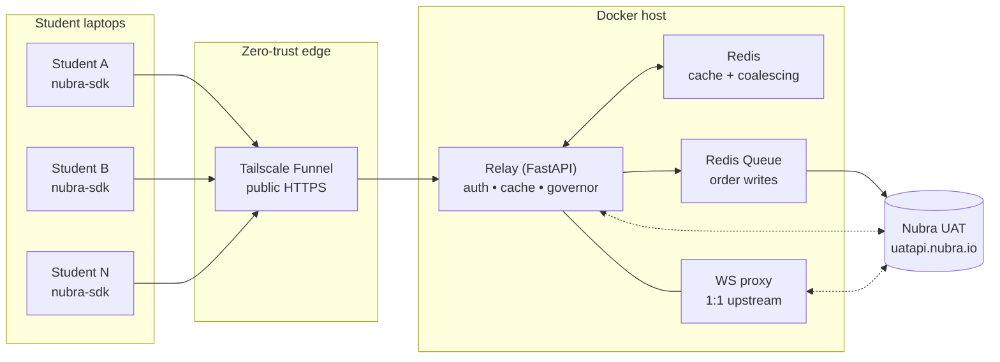
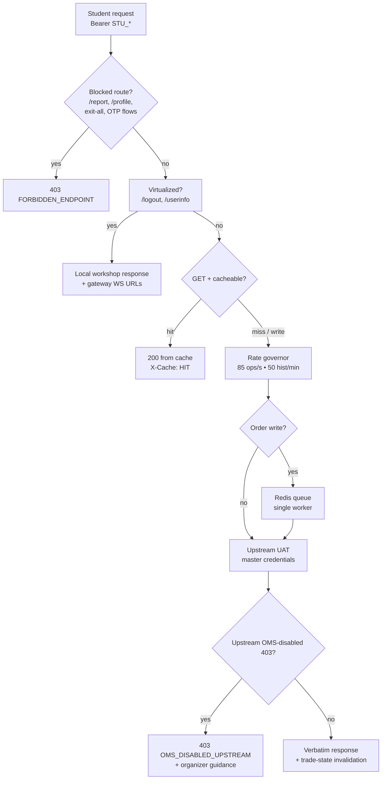
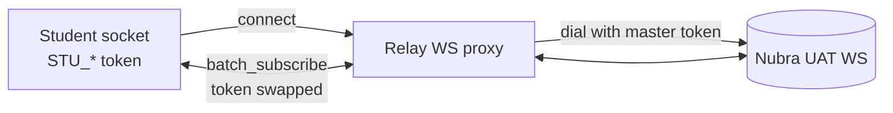

# Nubra UAT Relay & Queue Gateway

A transparent relay gateway that lets a whole workshop share **one** authenticated
Nubra Trading API (v3) UAT session — no per-student logins, no OTP round-trips,
no knocked-off sessions.

[](./Dockerfile)
[](./app/main.py)
[](https://pypi.org/project/nubra-workshop/)
[](https://pypi.org/project/nubra-sdk/)
[](https://nubra.io/products/api/docs/)

- **Students:** [`pip install nubra_workshop`](https://pypi.org/project/nubra-workshop/)
  — see [Student guide](#-student-guide) below.
- **Organizers:** `docker compose up -d` — see
  [Organizer quickstart](#-organizer-quickstart).
- **Deep dive:** [`docs/DMA_ARCHITECTURE.md`](./docs/DMA_ARCHITECTURE.md).

---

## How it works

Students point the official [`nubra-sdk`](https://pypi.org/project/nubra-sdk/)
at the relay instead of Nubra. The relay swaps in the master UAT credentials
upstream, caches repeated market data, governs outbound rate, and streams
WebSockets through. Payloads and schemas stay 100% Nubra v3.



A single REST request travels like this:



WebSocket connections are proxied 1:1 with token substitution:



> Scale note: load-tested to **600 concurrent sockets, zero failures**
> (`scripts/ws_burst.py`). Nubra caps WebSocket usage by **per-session
> subscription weight**, not connection count — and all students share one
> session, so keep total subscribed streams reasonable. See
> [subscription limits](https://nubra.io/products/api/docs/python-sdk-v3/realtime-data/subscription-limits.html).

---

## 📦 Student guide

**1. Install**

```bash
pip install nubra-sdk nubra_workshop
```

Package links:
[nubra_workshop on PyPI](https://pypi.org/project/nubra-workshop/) ·
[nubra-sdk on PyPI](https://pypi.org/project/nubra-sdk/) ·
[Nubra API docs](https://nubra.io/products/api/docs/)

**2. Connect** — two lines at the top of every script (the `assert` proves you
are on the gateway, not real UAT):

```python
import nubra_workshop
nubra_workshop.apply_patch()
assert nubra_workshop.is_active(), nubra_workshop.status()

from nubra_python_sdk.start_sdk import InitNubraSdk, NubraEnv
from nubra_python_sdk.refdata.instruments import InstrumentData
from nubra_python_sdk.marketdata.market_data import MarketData
from nubra_python_sdk.trading.trading_data import NubraTrader

nubra = InitNubraSdk(NubraEnv.UAT)  # virtual session, no OTP/MPIN
```

No accounts, no phone numbers, no OTP. `nubra_workshop.status()` diagnoses
routing at any time. Custom relay? `export NUBRA_GATEWAY_URL="https://..."`.

**3. Five rules that bite everyone**

| # | Rule |
|---|------|
| 1 | Orders go through `trader.create_order(...)` — there is **no** `place_order()` |
| 2 | Prices are **integer paise** (`116770` = Rs 1167.70) |
| 3 | Every order needs an integer `refId` from `InstrumentData.get_instrument_by_symbol(...)` (watch for `{"msg": ...}` not-found) |
| 4 | `stratTags` takes **exactly one hyphenated tag**, e.g. `["team-alpha-leg1"]` |
| 5 | Orderbook/greeks sockets need `str(ref_id)`, not symbols; `on_connect`/`on_close` receive one argument |

**4. What works / what doesn't** (relay-account dependent, not code):

| Works | Currently blocked upstream |
|---|---|
| Instruments (NSE/BSE/MCX masters) | `create_order` / modify / cancel |
| Current price, quotes, historical candles | `get_margin` |
| Option chain + Greeks, fundamentals | `funds` / `holdings` / `positions` |

Blocked calls return a clear `OMS_DISABLED_UPSTREAM` error naming the cause.
Trading code still runs as dry-runs showing exact payloads.

---

## 🛠️ Organizer quickstart

**1. Credentials** — verify master UAT login and mint the `.env`:

```bash
cd ~/projects/nubra-relay-gateway
uv run scripts/setup_credentials.py
```

**2. Launch** (all services restart automatically unless stopped):

```bash
docker compose up -d
```

**3. Get the public URL** and hand it to students with the two-line header above:

```bash
uv run scripts/get_gateway_url.py
```

**4. Verify** — diagnostics, relay test, socket burst:

```bash
python3 scripts/test_relay.py
python3 scripts/ws_burst.py 120 15   # 120 parallel sockets, ~30s
```

---

## ⚙️ Configuration (`.env`)

| Variable | Default | Purpose |
|---|---|---|
| `NUBRA_UAT_BASE` | `https://uatapi.nubra.io` | Upstream sandbox (UAT-only; no prod path exists) |
| `NUBRA_SESSION_TOKEN` / `NUBRA_DEVICE_ID` | *(required)* | Master UAT credentials |
| `ENABLE_STUDENT_VERIFICATION` | `false` | Validate students against `students.json` when `true` |
| `ALLOWED_STUDENT_TOKENS` | `STU_TOKEN_ALPHA,...` | Accepted tokens / prefix |
| `MAX_UPSTREAM_RPS` | `85` | Trading/general governor (UAT ceiling: 100/s) |
| `MAX_HISTORICAL_RPM` | `50` | Historical governor (ceiling: 60/min) |
| `ENABLE_CACHE` | `true` | Redis/memory cache + single-flight coalescing |
| `CACHE_TTL_INSTRUMENTS` / `_ORDERBOOK` / `_QUOTES` / `_HISTORICAL` | `3600` / `1.5` / `1.0` / `60.0` | Per-path TTL seconds |
| `TS_AUTHKEY` | *(optional)* | Tailscale key for public Funnel ingress |

Blocked by default (403 `FORBIDDEN_ENDPOINT`): `/report/*`, `/profile`,
`/trading/exit-all-positions`, `/trading/orders/cancel-all`, OTP/TOTP/login
endpoints. `/logout` and `/userinfo` are safely virtualized instead of forwarded.

---

## 🧪 Testing

```bash
.venv/bin/python -m pytest tests/test_oms_disabled_mapping.py tests/test_relayed_headers.py -q
```

Unit tests run anywhere. The remaining suites in `tests/` are integration
tests against a live local stack (`localhost:8000`).

---

## 🛡️ Security model

Single shared master session upstream; students identified by Bearer token,
never see master credentials. Sensitive reporting and destructive bulk routes
are deny-listed. See [`docs/DMA_ARCHITECTURE.md`](./docs/DMA_ARCHITECTURE.md)
for the full data-model and threat reference.

Support: `support@nubra.io` (SDK/product) · GitHub Issues (relay).
